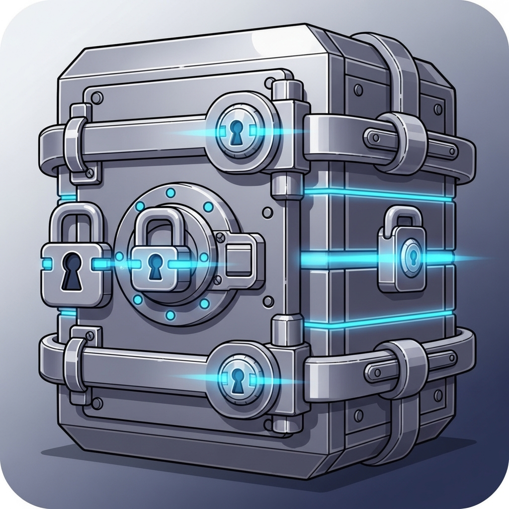
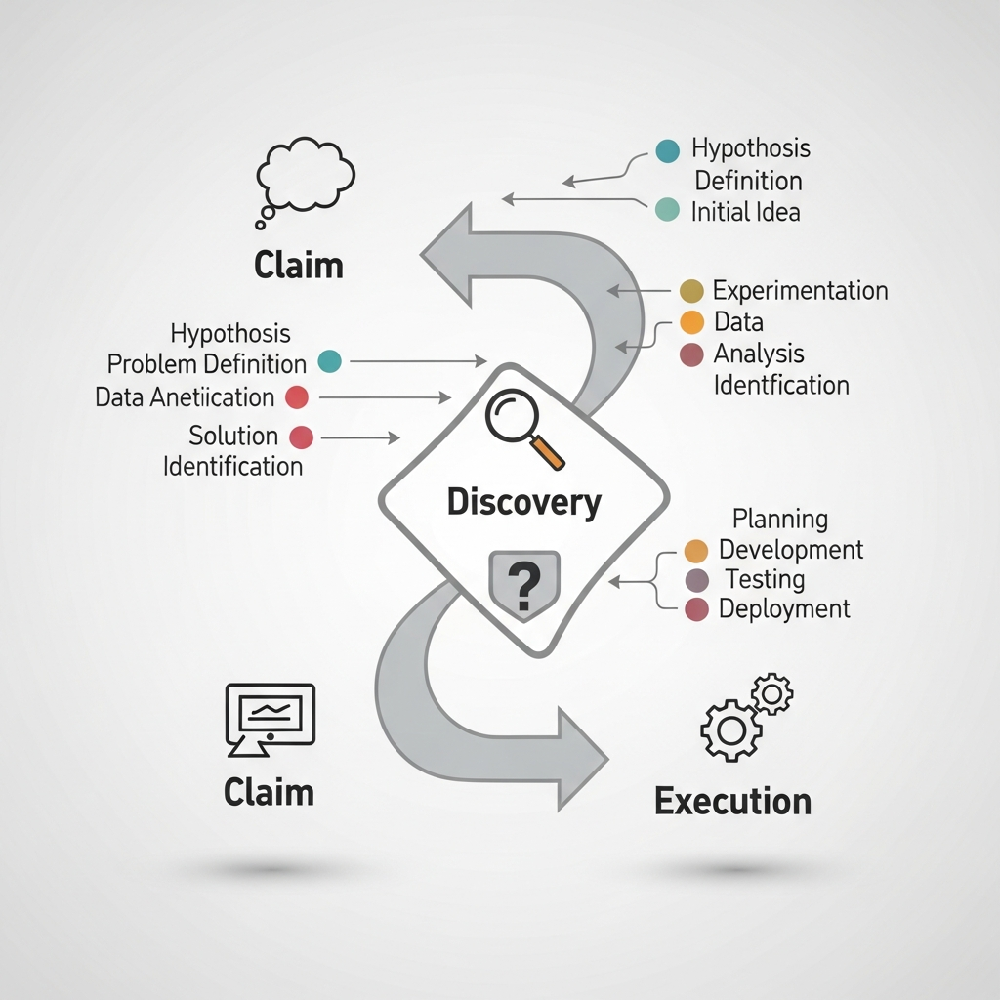
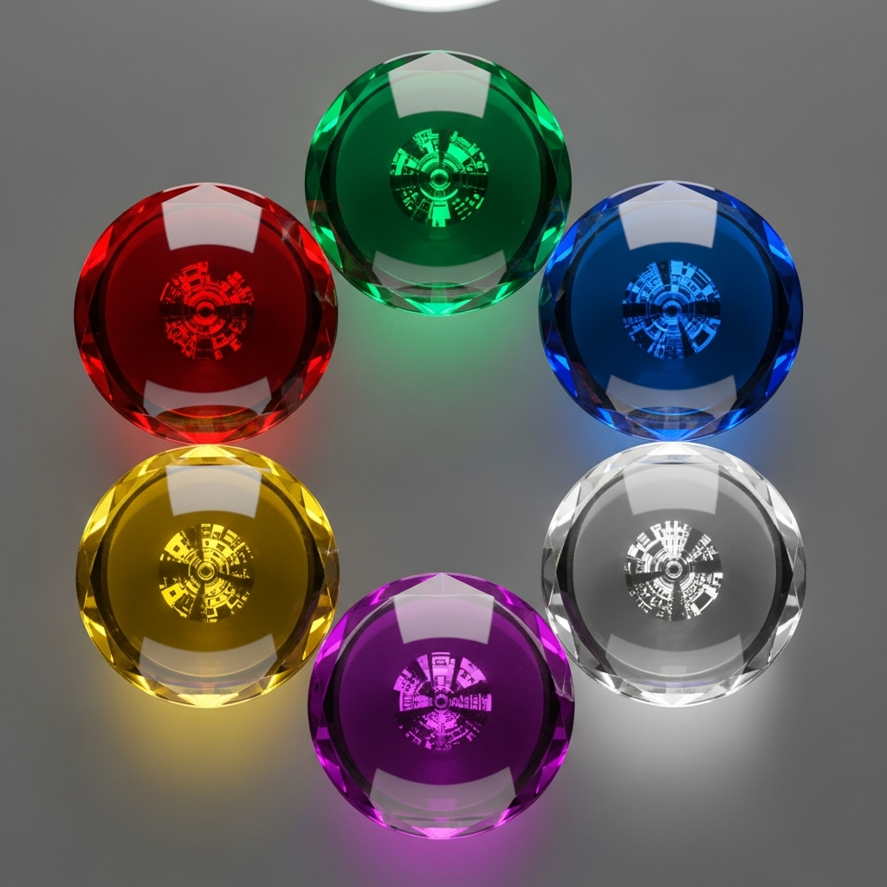
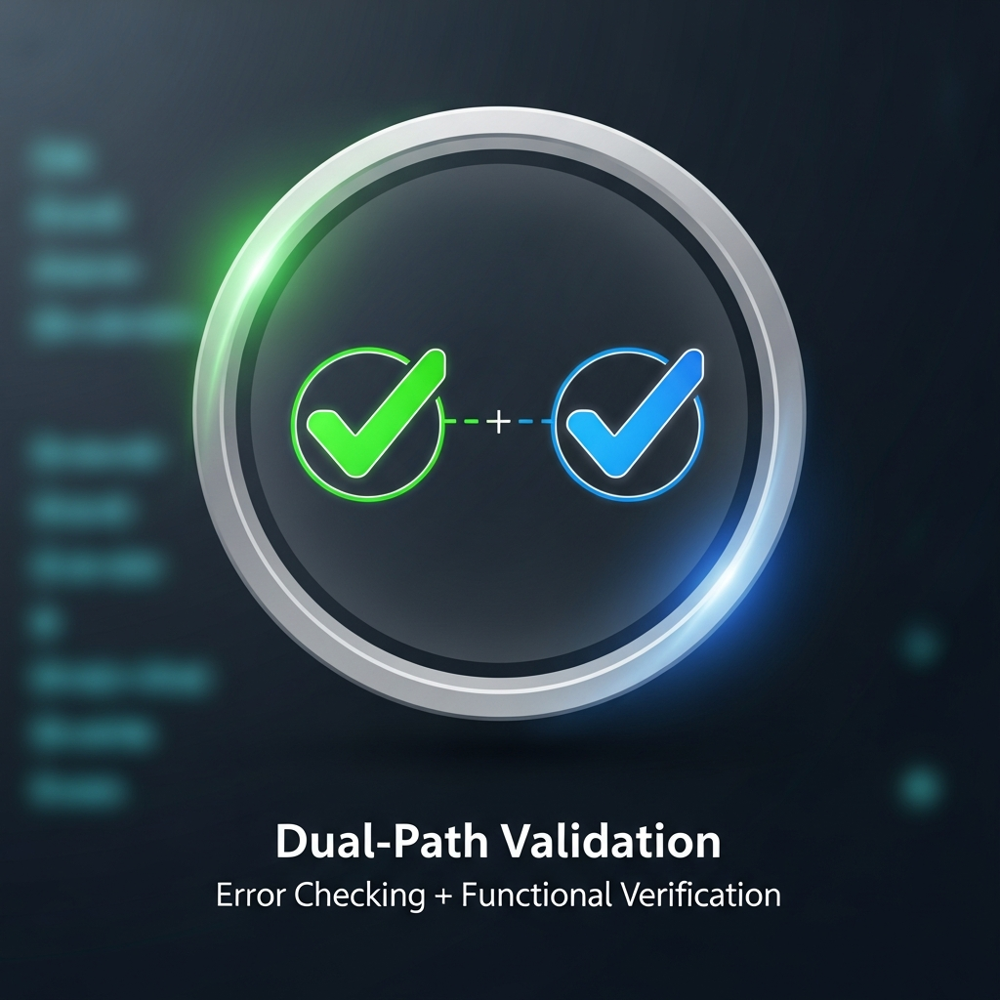
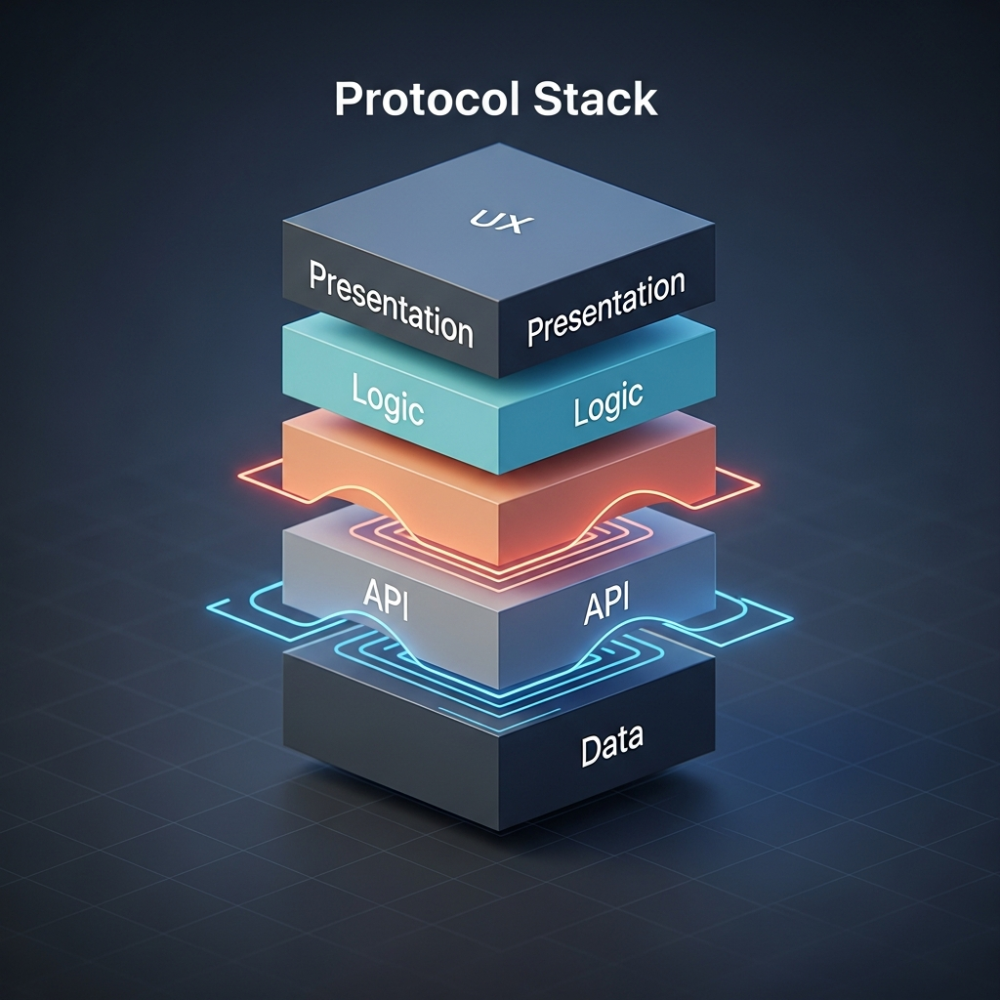
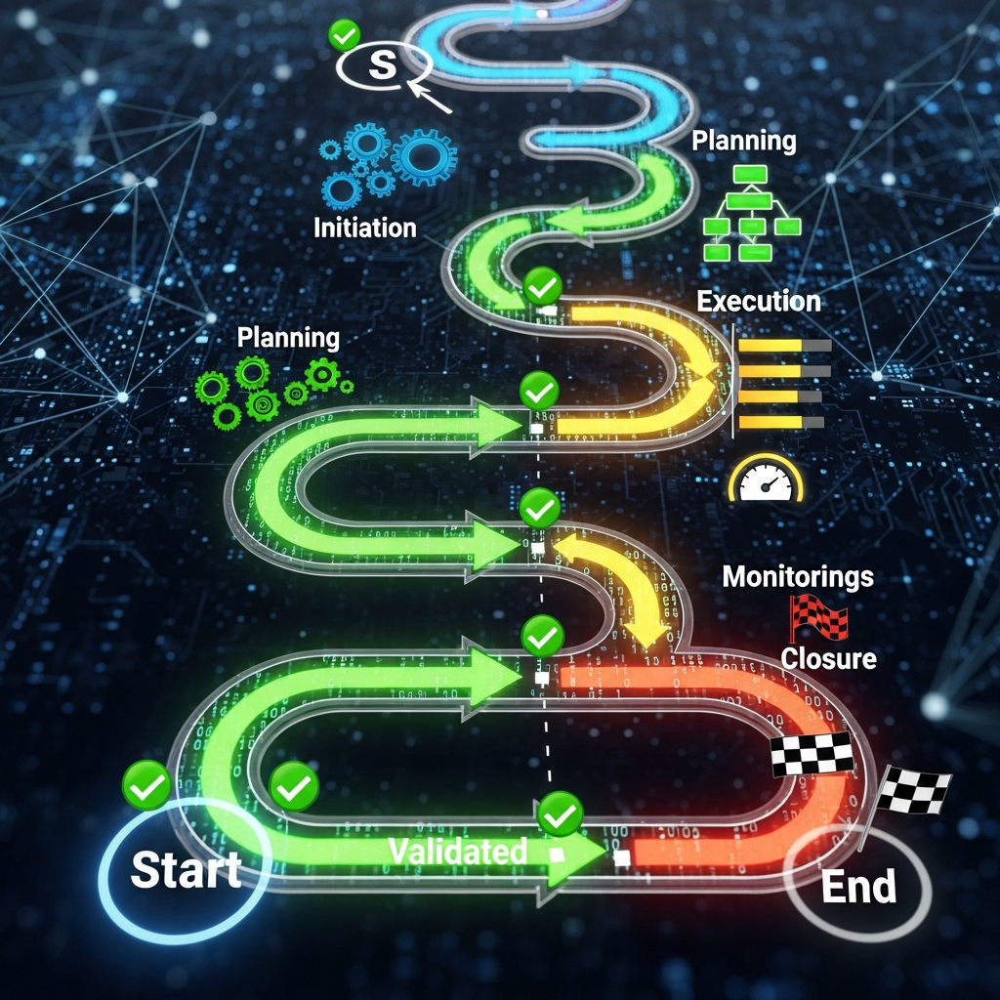

# SET IN STONE - PROTOCOL VISUAL GUIDE

**All 20 protocols as representative images. One glance = instant understanding.**

---

## THE 20 PROTOCOLS - VISUAL REFERENCE

### REALITY FOUNDATION (Protocols 1-3)

**🔒 Protocol 1: AS/400 DOCTRINE**

*Database locks it down. Constraints matter. No human checklists.*

**🔐 Protocol 2: AUTHENTICITY PILLAR**

*Every number traces to a database query. Real data, real calculations. No mock/fake/hardcoded.*

**🎯 Protocol 3: CLAIMS → DISCOVERABILITY → EXECUTABILITY**

*No orphaned features. Button exists = button works. Truth over advertising.*

---

### QUALITY FOUNDATION (Protocols 4-9)

**🔍 Protocol 4: MULTI-LENS REVIEW**

*6 lenses: Architect, Visual, Role, Readability, Innovation, D.A.I.S.Y.*

**💎 Protocol 5: D.A.I.S.Y. TEN COMMANDMENTS**

*Solves 3+ pain points. Anticipates. Reveals. Respects time. Creates wonder. Speaks truth.*

**🏗️ Protocol 6: FORM FIRST PROTOCOL**

*Build real function FIRST. Test data flow. Then polish UI. Pretty ≠ Working.*

**✅ Protocol 7: DUAL VALIDATION**

*Error validation (no 500s) + Functional validation (buttons work, saves persist). Both required.*

**🏢 Protocol 8: PROTOCOL STACK (5 LAYERS)**

*Data → API → Business Logic → Presentation → UX. Each layer guards the next.*

**📸 Protocol 9: SCREENSHOT-AFTER-MODIFICATION**

*Visual proof. Elements exist. Functionality works. No regressions. All states confirmed.*

---

### EXECUTION FOUNDATION (Protocols 10-15)

**⚡ Protocol 10: EFFICIENCY PROTOCOLS**

*Parallel calls (30-40% savings). CATCH token strategy. Call backup <5 min stuck.*

**🧩 Protocol 11: COMPONENT COMPOSITION**

*10 reusable > 100 custom. Extract after 3x use. Check before building.*

**🎬 Protocol 12: SHOW REAL FUNCTIONALITY**

*Configured ≠ Working. Show actual API responses. Verbose console logs. Real data only.*

**🎉 Protocol 13: EXCLAIMING VS EXPLAINING**

*Deploy = celebrating. Never explaining. "Look how fast!" ✓ | "Not quite ready..." ✗*

**👨‍💼 Protocol 14: SENIOR DEVELOPER PERSONA**

*Make decisions. Fix bugs. Only ask on: business logic, UI, data deletion, workflow changes.*

**✔️ Protocol 15: CRITICAL PATH VALIDATION**

*LOGIN → NAVIGATE → VIEW → CREATE → EDIT → DELETE → SEARCH → EXPORT. All work end-to-end.*

---

### INTEGRITY FOUNDATION (Protocols 16-20)

**🖱️ Protocol 16: IF IT LOOKS CLICKABLE**

*Something MUST happen. No false affordances. Every click leads somewhere.*

**🗄️ Protocol 17: DATABASE AS AUTHORITATIVE SOURCE**

*ALL information in database. Single source of truth. Never duplicate.*

**📦 Protocol 18: STRUCTURED CONTENT PATTERN**

*Return BOTH human-readable AND machine-readable (typed objects, not stringified JSON).*

**🛡️ Protocol 19: GRACEFUL DEGRADATION**

*Continue on partial failure. Show what's broken. Auto-recover with fallbacks.*

**🔄 Protocol 20: FLYWHEEL / DISK STACKING**

*Precision like a gyro. No wobble. In alignment = precision, straight. Counts always increase. Knowledge compounds.*

---

## QUICK VISUAL SCAN (Use at Session Start)

### REALITY CHECK
```
🔒 Database Fortress    🔐 Real Data    🎯 Path Works
```

### QUALITY CHECK
```
🔍 6 Lenses    💎 Quality    🏗️ Function First    ✅ Dual Check    🏢 5 Layers    📸 Screenshot
```

### EXECUTION CHECK
```
⚡ Efficient    🧩 Reusable    🎬 Real    🎉 Celebrate    👨‍💼 Autonomous    ✔️ End-to-End
```

### INTEGRITY CHECK
```
🖱️ Clickable Works    🗄️ DB Truth    📦 Typed    🛡️ Resilient    🔄 Growing
```

---

## HOW TO USE

### Session Start (30 Seconds)
1. Look at the 4 visual scans above
2. Ask: Do we pass Reality + Quality + Execution + Integrity?
3. If any red flags → drill into that protocol image

### Before Building
1. Review REALITY CHECK images (protocols 1-3)
2. Review QUALITY CHECK images (protocols 4-9)
3. Proceed

### During Work
1. When stuck → which protocol applies? → Look at image → Instant context

### Before Demo
1. Full visual scan of all 20 protocol images
2. Each image should represent a ✓ (checked/done)

---

## TOKEN SAVINGS

Instead of:
```
"Let me review the 20 SET IN STONE protocols and text descriptions..."
[Reading full text = 1,000+ tokens]
```

Use:
```
"Scanning PROTOCOL_VISUAL_GUIDE..."
[Looking at 20 images = 50 tokens context]
```

**44% token reduction + 300% clarity increase**

---

## VISUAL LEGEND

| Image | Meaning | Use When |
|-------|---------|----------|
| 🔒 Fortress | System prevents mistakes | Checking database constraints |
| 🔐 Real Data | Authentic information | Verifying data sources |
| 🎯 Path | Complete journey works | Ensuring no orphaned features |
| 🔍 Lenses | Multiple perspectives | Starting architecture review |
| 💎 Gem | Excellence/quality | Evaluating feature quality |
| 🏗️ Foundation | Build core first | Planning implementation |
| ✅ Check | Dual verification | Before claiming "done" |
| 🏢 Stack | Layered protection | Architecture design |
| 📸 Screenshot | Visual proof | Showing completed work |
| ⚡ Lightning | Speed/efficiency | Optimizing process |
| 🧩 Blocks | Reusable components | Component selection |
| 🎬 Real | Authentic output | Verification step |
| 🎉 Party | Ready to celebrate | Before deployment |
| 👨‍💼 Leader | Autonomous decisions | Making technical choices |
| ✔️ Complete | End-to-end works | Final validation |
| 🖱️ Click | Interaction works | UX design review |
| 🗄️ Database | Single source truth | Data modeling |
| 📦 Package | Well-structured | API response design |
| 🛡️ Shield | Resilience | Error handling |
| 🔄 Growth | Compounding knowledge | Long-term value |

---

**Last Updated:** November 28, 2025  
**Image Set:** 20 Protocol Visualizations  
**Purpose:** Instant visual reference + token efficiency  
**Ideal For:** Pre-session scanning, quick decision-making, team communication
